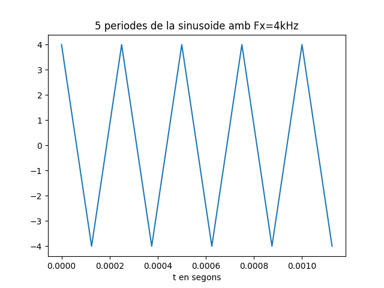
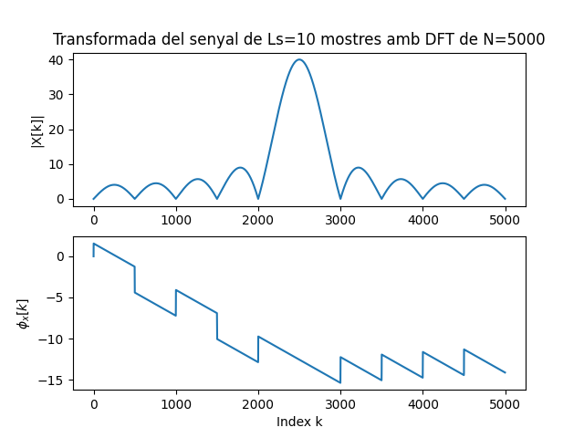
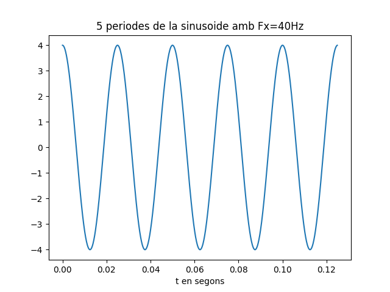
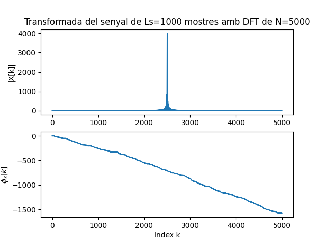
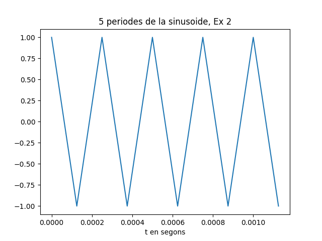
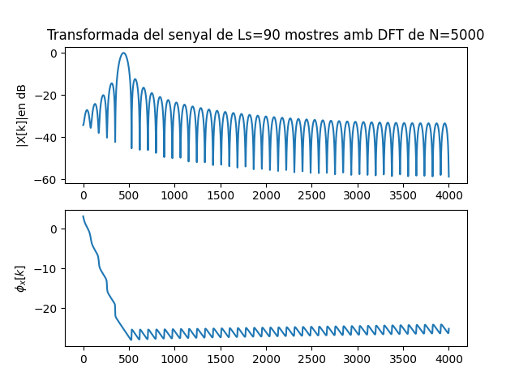
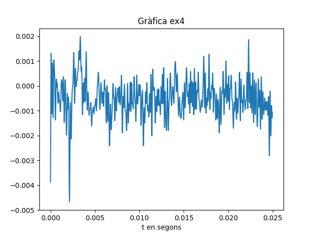
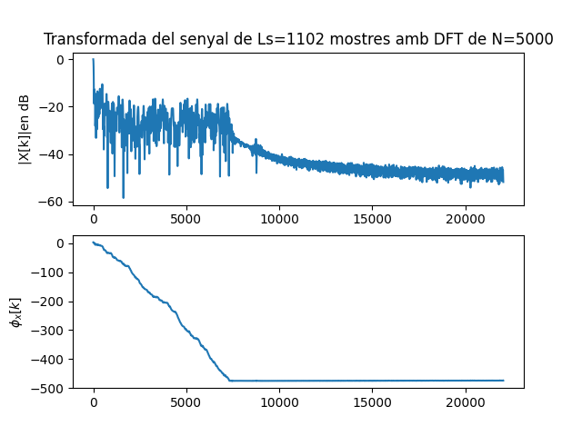

Primera tasca APA 2023: Anàlisi fitxer de so
============================================

## Nom i cognoms: Milene Granda Becerra


## Representació temporal i freqüencial de senyals d'àudio.

### Domini temporal

Per llegir, escriure i representar un fitxer en format `*.wav` en python podem fem servir els següents mòduls:

- Numpy:
```python
import numpy as np
```
- Matplotlib: 
```python
import matplotlib.pyplot as plt
```
- Soundfile:
```python
import soundfile as sf
```

Per **crear** i **guardar** a un fitxer un senyal sinusoidal de freqüència `fx Hz`, digitalitzat a `fm Hz`, de durada `T` segons i amplitud 
`A` fem:

```python
T= 2.5                               # Durada de T segons
fm=8000                              # Freqüència de mostratge en Hz
fx=440                               # Freqüència de la sinusoide
A=4                                  # Amplitud de la sinusoide
pi=np.pi                             # Valor del número pi
L = int(fm * T)                      # Nombre de mostres del senyal digital
Tm=1/fm                              # Període de mostratge
t=Tm*np.arange(L)                    # Vector amb els valors de la variable temporal, de 0 a T
x = A * np.cos(2 * pi * fx * t)      # Senyal sinusoidal
sf.write('so_exemple1.wav', x, fm)   # Escriptura del senyal a un fitxer en format wav
```

El resultat és un fitxer guardat al directori de treball i que es pot reproduir amb qualsevol reproductor d'àudio

Per **representar** gràficament 5 períodes de senyal fem:

```python
Tx=1/fx                                   # Període del senyal
Ls=int(fm*5*Tx)                           # Nombre de mostres corresponents a 5 períodes de la sinusoide

plt.figure(0)                             # Nova figura
plt.plot(t[0:Ls], x[0:Ls])                # Representació del senyal en funció del temps
plt.xlabel('t en segons')                 # Etiqueta eix temporal
plt.title('5 periodes de la sinusoide')   # Títol del gràfic
plt.show()                                # Visualització de l'objecte gràfic. 
```

El resultat del gràfic és:


> Nota: Si es treballa amb ipython, es pot escriure %matplotlib i no cal posar el plt.show() per veure gràfics

El senyal es pot **escoltar (reproduir)** directament des de python important un entorn de treball amb els dispositius de so, com per 
exemple `sounddevice`:

```python
import sounddevice as sd      # Importem el mòdul sounddevice per accedir a la tarja de so
sd.play(x, fm)                # Reproducció d'àudio
```

### Domini transformat

Domini transformat. Els senyals es poden analitzar en freqüència fent servir la Transformada Discreta de Fourier. 

La funció que incorpora el paquet `numpy` al submòdul `fft` és `fft`:

```python
from numpy.fft import fft     # Importem la funció fft
N=5000                        # Dimensió de la transformada discreta
X=fft(x[0 : Ls], N)           # Càlcul de la transformada de 5 períodes de la sinusoide
```

I podem representar el mòdul i la fase, en funció de la posició de cada valor amb:

```python
k=np.arange(N)                        # Vector amb els valors 0≤  k<N

plt.figure(1)                         # Nova figura
plt.subplot(211)                      # Espai per representar el mòdul
plt.plot(k,abs(X))                    # Representació del mòdul de la transformada
plt.title(f'Transformada del senyal de Ls={Ls} mostres amb DFT de N={N}')   # Etiqueta del títol
plt.ylabel('|X[k]|')                  # Etiqueta de mòdul
plt.subplot(212)                      # Espai per representar la fase
plt.plot(k,np.unwrap(np.angle(X)))    # Representació de la fase de la transformad, desenroscada
plt.xlabel('Index k')                 # Etiqueta de l'eix d'abscisses 
plt.ylabel('$\phi_x[k]$')             # Etiqueta de la fase en Latex
plt.show()                            # Per mostrar els grafics
```


Proves i exercicis a fer i entregar
-----------------------------------

1. Reprodueix l'exemple fent servir diferents freqüències per la sinusoide. Al menys considera $f_x = 4$ kHz, a banda d'una
    freqüència pròpia en el marge audible. Comenta els resultats.
```python
    
   #Prova 1 amb Fx = 4kHz
    fx2 = 4000
    x2 = A * np.cos(2 * pi * fx2 * t)      
    sf.write('so_exemple2.wav', x2, fm)   #Creacio del nou so amb Fx=4kHz

    Tx2=1/fx2                                  # Període del senyal amb fx= 4kHz
    Ls=int(fm*5*Tx2)                           

    plt.figure(0)                             
    plt.plot(t[0:Ls], x2[0:Ls])                
    plt.xlabel('t en segons')                 
    plt.title('5 periodes de la sinusoide amb Fx=4kHz')   
    plt.show() 
```
El resultat de la gràfica és
    



Per escoltar-lo:
 ```python
    sd.play(x2, fm)   #Reproducció so 
```    
Per poder trobar la seva transformada:
```python
    N=5000                        
    X2=fft(x2[0 : Ls], N)           

    k=np.arange(N)                        

    plt.figure(1)                         
    plt.subplot(211)                      
    plt.plot(k,abs(X2))                    
    plt.title(f'Transformada del senyal de Ls={Ls} mostres amb DFT de N={N}')   
    plt.ylabel('|X[k]|')                  
    plt.subplot(212)                      
    plt.plot(k,np.unwrap(np.angle(X2)))    
    plt.xlabel('Index k')                 
    plt.ylabel('$\phi_x[k]$')             
    plt.show()                            
```
Trobant així la grafica següent:

 
```python
#Prova 2 amb Fx = 40Hz
    fx3 = 40 #Nova freq Fx= 40Hz
    x3 = A * np.cos(2 * pi * fx3 * t)      
    sf.write('so_exemple3.wav', x3, fm)   #Creació del fitxer wav amb Fx=40Hz

    Tx3=1/fx3                                 
    Ls=int(fm*5*Tx3)                           

    plt.figure(0)                             
    plt.plot(t[0:Ls], x3[0:Ls])                
    plt.xlabel('t en segons')                 
    plt.title('5 periodes de la sinusoide amb Fx=40Hz')   
    plt.show()
```
Resultant així la següent gràfica:


Per escoltar-lo:
```python
    sd.play(x3, fm)  #Reproducció del nou so
```
Per poder trobar la seva transfomada:
```python
    X3=fft(x2[0 : Ls], N)           

    k=np.arange(N)                        

    plt.figure(2)                         
    plt.subplot(211)                      
    plt.plot(k,abs(X3))                    
    plt.title(f'Transformada del senyal de Ls={Ls} mostres amb DFT de N={N}')   
    plt.ylabel('|X[k]|')                  
    plt.subplot(212)                      
    plt.plot(k,np.unwrap(np.angle(X3)))    
    plt.xlabel('Index k')                  
    plt.ylabel('$\phi_x[k]$')             
    plt.show()                            
```
Trobant així la grafica següent:


### Comentaris:
Podem observar com en aquest primer cas en la primera gràfica els 5 períodes tenen un temps de durada d'1 ms aproximadament. Així mateix, podem veure que conté una amplitud de 4 ms.

Seguidament per al mateix cas, en la gràfica on representa la seva transformada es veu una funció sinc de mòdul 40 on es conté unes 10 mostres per als períodes aplicats.

Per al segon cas veiem com en la primera gràfica els 5 períodes a diferència del primer cas tenen una durada més gran, d'uns 0,12 segons aproximadament. De manera similar al cas anterior encara tenen una amplitud de 4 ms.

A continuació podem veure com en la seva TF s'hi representa un sol pols de mòdul 4000.


2. Modifica el programa per considerar com a senyal a analitzar el senyal del fitxer wav que has creat 
    (`x_r, fm = sf.read('nom_fitxer.wav')`).
    ```python
    x_r,fm=sf.read('so_exemple2.wav') # Agafem el so creat en el cas 1 del ex1
    #Importem la info del 'so_exemple2.wav'
    Tm =1/fm
    t=Tm*np.arange(len(x_r))
    sf.write('so_ex2.wav',x_r,fm) #Creem un nou so per l'ex2
    ```
    - Insereix a continuació una gràfica que mostri 5 períodes del senyal i la seva transformada.

    Per poder obtenir aquesta gràfica realitzem el següent codi:
    ```python
    fx=4000
    Tx=1/fx                                   # Període del senyal
    Ls=int(fm*5*Tx)                           # Nombre de mostres corresponents a 5 períodes de la sinusoide

    plt.figure(21)                             
    plt.plot(t[0:Ls], x_r[0:Ls])                
    plt.xlabel('t en segons')              
    plt.title('5 periodes de la sinusoide, Ex 2')   
    plt.show()    
    ```
Obtenint la següent gràfica:


Per obtenir la gràfica de la transformada:
```python
N=5000
XR =fft(x_r[0:Ls],N)
k=np.arange(N)                        

plt.figure(1)                         
plt.subplot(211)                      
plt.plot(k,abs(XR))                    
plt.title(f'Transformada del senyal de Ls={Ls} mostres amb DFT de N={N}')   
plt.ylabel('|X[k]|')                  
plt.subplot(212)                      
plt.plot(k,np.unwrap(np.angle(XR)))    
plt.xlabel('Index k')                 
plt.ylabel('$\phi_x[k]$')             
plt.show()   
```
Obtenint la següent gràfica:

 - Explica el resultat del apartat anterior.

A causa que en aquest exercici s'ha fet ús del fitxer anterior on Fx = 4 kHz s'observa com les gràfiques són idèntiques a l'exercici 1.

3. Modifica el programa per representar el mòdul de la Transformada de Fourier en dB i l'eix d'abscisses en el marge de
    $0$ a $f_m/2$ en Hz.

    Per realitzar aquesta modificació realitzem el següent codi:

    ```python
    T=2.5
    fm = 8000
    fx=440
    A=4
    pi=np.pi
    L=int(fm*T)
    Tm=1/fm
    t=Tm*np.arange(L)
    x=A*np.cos(2*pi*fx*t)
    sf.write('so_ex3.wav',x,fm)

    Tx=1/fx                                   
    Ls=int(fm*5*Tx)                           

    N=5000                       
    X=fft(x[0 : Ls], N) 
    k=np.arange(N)                        
    fk = k/N*fm  #Trobem fk per a l'eix d'abscisses de la gràfica
    plt.figure(1)                         
    plt.subplot(211)                      
    plt.plot(fk/2,abs(20*np.log10(X/max(X))))   # Representem el mòul de la Transformada tal i com se'ns demana (0 a fk/2) i en dB                 
    plt.title(f'Transformada del senyal de Ls={Ls} mostres amb DFT de N={N}')   # Etiqueta del títol
    plt.ylabel('|X[k]|')                  
    plt.subplot(212)                      
    plt.plot(k,np.unwrap(np.angle(X)))    
    plt.xlabel('Index k')                  
    plt.ylabel('$\phi_x[k]$')             
    plt.show() 
    ```
Trobant així la gràfica següent:

    
- Comprova que la mesura de freqüència es correspon amb la freqüència de la sinusoide que has fet servir.

 - Com pots identificar l'amplitud de la sinusoide a partir de la representació de la transformada? 
      Comprova-ho amb el senyal generat.
    
    Aquesta amplitud no es pot trobar a través d'aquesta gràfica, ja que en normalitzar pel màxim el resultat és 1.

> NOTES:
>
> - Per representar en dB has de fer servir la fórmula següent:
>
> $X_{dB}(f) = 20\log_{10}\left(\frac{\left|X(f)\right|}{\max(\left|X(f)\right|}\right)$
>
> - La relació entre els valors de l'índex k i la freqüència en Hz és:
>
> $f_k = \frac{k}{N} f_m$

4. Tria un fitxer d'àudio en format wav i mono (el pots aconseguir si en tens amb altres formats amb el programa Audacity). 
    Llegeix el fitxer d'àudio i comprova:

    - Freqüència de mostratge.
    - Nombre de mostres de senyal.
    - Tria un segment de senyal de 25ms i insereix una gráfica amb la seva evolució temporal.
    - Representa la seva transformada en dB en funció de la freqüència, en el marge $0\le f\le f_m/2$.

    Per aquest exercici he fet ús de l'àudio 'luzbel44.wav', fent ús del codi que s'exposa a continuació:
    ```python
    x_r,fm=sf.read('luzbel44.wav') 
    T= 0.025                                                     
    Ls = int(fm * T)                      
    Tm=1/fm                              
    t=Tm*np.arange(Ls)                    
    sf.write('so_exercici4.wav', x_r, fm)   
                                    
    plt.figure(0)                            
    plt.plot(t[0:Ls], x_r[0:Ls])              
    plt.xlabel('t en segons')                 
    plt.title('Gràfica ex4')   
    plt.show() 
    ```
    
   
    ```python
    N=5000                       
    X=fft(x_r[0 : Ls], N)          

    k=np.arange(N)                        

    sd.play(x_r, fm) 

    N=5000                       
    X=fft(x_r[0 : Ls], N) 
    k=np.arange(N)   
    Xdb=20*np.log10(np.abs(X)/max(np.abs(X)))                     
    fk = k[0:N//2+1]*fm/N  #Trobem fk per a l'eix d'abscisses de la gràfica
    plt.figure(1)                         
    plt.subplot(211)                      
    plt.plot(fk,Xdb[0:N//2+1])   # Representem el mòul de la Transformada tal i com se'ns demana (0 a fk/2) i en dB                 
    plt.title(f'Transformada del senyal de Ls={Ls} mostres amb DFT de N={N}')   # Etiqueta del títol
    plt.ylabel('|X[k]|en dB')                  
    plt.subplot(212)                      
    plt.plot(fk,np.unwrap(np.angle(X[0:N//2+1])))    
    plt.ylabel('$\phi_x[k]$')             
    plt.show()  
    ```


- Quines son les freqüències més importants del segment triat?
   
    Les freqüències més importants que s'observen a la gràfica són aproximadament des de la de 2 kHz fins a la de 8 kHz. 

Entrega
-------

- L'alumne ha de respondre a totes les qüestions formulades en aquest mateix fitxer, README.md.
    - El format del fitxer es l'anomenat *Markdown* que permet generar textos amb capacitats gràfiques (com ara *cursiva*, **negreta**,
      fòrmules matemàtiques, taules, etc.), sense perdre la llegibilitat en mode text.
    - Disposa d'una petita introducció a llenguatge de Markdown al fitxer `MARKDOWN.md`.
- El repositori GitHub ha d'incloure un fitxer amb tot el codi necesari per respondre les qüestions i dibuixar les gràfiques.
- El nom del fitxer o fitxers amb el codi ha de començar amb les inicials de l'alumne (per exemple, `fvp_codi.py`).
- Recordéu ficar el el vostre nom complet a l'inici del fitxer o fitxers amb el codi i d'emplar el camp `Nom i cognoms` a dalt de tot
  d'aquest fitxer, README.md.
